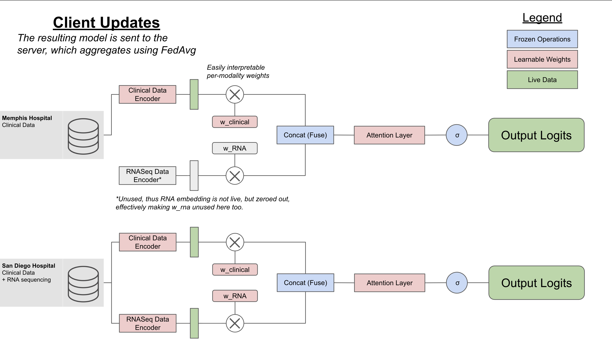
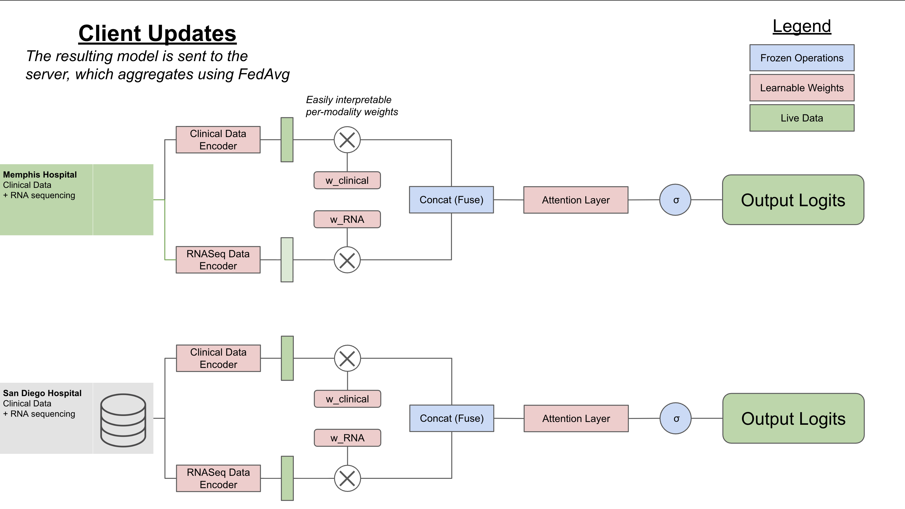

# Multimodal Framework for Federated Learning (MuFFLe)
 

## Contributors
1. Tyler Yang
2. Shreyan Nalwad
3. Varalakshmi Perumal
4. Anna Boeva
5. James Mu
6. Amrit Gaire
7. Zhenghao (Chester) Xiao
8. Yiman Wu
9. Jon Moller
10. Mahtabin Rodela 
11. Yajushi Khurana


## Quick Start
The Memphis/San-Diego example workflow is contained in `src/`. We will provide instructions for `.venv/` setup; you can use `conda`, `PyEnv`, or any other Python environment manager if you'd like.
```bash
python3 -m venv .venv       # create your environment
source .venv/bin/activate   # activate it
pip install "nvflare[PT]" torchinfo tensorboard matplotlib jupyter ipykernel # install necessary packages
```
Now we need to get the RNA-sequencing data and clinical data from [CHIMERA Task 3](https://chimera.grand-challenge.org/task-3-bladder-cancer-recurrence-prediction/). Make sure you have AWS CLI installed (e.g., via Homebrew on MacOS).
```bash
# List files
aws s3 ls --no-sign-request s3://chimera-challenge/v2/task3/data/3A_001/
# Copy all the Clinical Data and RNASeq Data
aws s3 cp --no-sign-request s3://chimera-challenge/v2/task3/data/ local/path/to/data/ --recursive --exclude "*" --include "*.json"
```
Now go into `src/multi-client-sim.py` and change the `DATASET_PATH` variable to wherever you downloaded the data.

You can now run the jupyter notebook `src/prf-of-concept.ipynb`! 

Logs for tensorboard are stored in `/tmp/nvflare/simulation/MEM_SAN_FedCollab/server/simulate_job/tb_events/`. More instructions are in the jupyter notebook `src/prf-of-concept.ipynb`.

# Introduction
MuFFLe is a privacy-preserving framework for integrating multimodal biomedical data (RNA sequencing, clinical features) for cancer prognosis. Using NVIDIA's NVFlare, each hospital site trains on its local data and shares only model updates—not raw patient data—with a central server for aggregation.

Cancer prognosis models require multimodal data (imaging, RNA-seq, clinical variables) across institutions, but data sharing is restricted due to privacy, regulatory, and institutional barriers. Integrating transcriptomics with clinical features improves prognostic performance, but most hospitals cannot pool raw patient data across sites. Centralized training is often infeasible due to HIPAA constraints, motivating a federated learning approach where data remains local.

Using NVIDIA’s NVFlare, each hospital trains locally on its multimodal data and shares only encrypted model updates with a central server, enabling global model learning while preserving patient privacy.

# Methods + Discussion
Training uses NVFlare's FedAvg algorithm across simulated sites, where each site specializes in one modality (e.g., Site-1 trains on clinical data, Site-2 on RNA). Sites receive the global model, train locally, and send weight updates back for aggregation—enabling collaborative learning while preserving privacy.

## Example Scenario
At a high level, we wanted to simulate a real-world scenario where federated learning and multimodal frameworks can mitigate data gaps stemming from unequal access to healthcare. 

We motivate this workflow using a hypothetical scenario: Consider we have 2 hospitals, one in San Diego and one in Memphis. Assume that, since San Diego is a larger city, (1) they will have more patients and (2) have more data modalities available per patient compared to Memphis.

We want to use federated learning to train a multimodal model that predicts tumor progression outcomes. We formalize this task as an instance of binary classification, 1 if the tumor progresses, and 0 otherwise. 

### Initial Scenario

At first, both hospitals have clinical data, but San Diego Hospital has more healthcare capabilities and can provide RNA sequencing data as well. This additional modality would be helpful for tumor progression prediction, but there is a data gap between different data sources.

To fix this, the multimodal fusion model architecture that we propose in MuFFLe is able to selectively turn off the RNASeq Encoder and zero out the embeddings, effectively telling the model to pay no attention to RNASeq on the Memphis client side.


### Strengths of our Framework and Architecture
In short: extensibility and interpretability.

**Extensibility**: It should be noted that there is additional flexibility that can be coordinated between hospitals; for example, if San Diego knows that they have more data and more modalities, they may opt to tune the model for more epochs and use a bigger batch size than the Memphis client. Furthermore, using different federated aggregation algorithms beyond `FedAvg` can give each client's results the appropriate importance. That's beyond the scope of this hackathon, but is easily extensible as long as you create a similar recipe as NVFlare's PyTorch `FedAvgRecipe`.

**Interpretability**: Furthermore, the learnable per-modality weights are very easily interpreted as "importance scores" for each modality towards predicting tumor progression. The attention layer can also show which parts of the concatenated embedding are most important, and which features within each sub-embedding are important. For example, if the attention scores are high in the RNASeq sub-embedding at specific positions, that corresponds to high importance for specific protein-coding genes towards predicting tumor prediction.

In the proof-of-concept, we run simulate federated learning on a 42M-parameter model for a few rounds just to show that the MuFFLe framework works. 

### Later, Extending the Framework via Continued Learning

Let's say that later on, the Memphis Hospital begins RNA Sequencing their patients. The multimodal framework proposed in MuFFLe is easily extended: the Memphis Client can just begin sending its new RNASeq data through the model, so now all data sources are using all data modalities to train the global fusion model.

### How we built this simulated scenario
We first chose an existing multimodal dataset so we could perform supervised learning at the client-level and perform evaluation at the server level. We chose the data from the Combining HIstology, Medical imaging (radiology) and molEcular data for medical pRognosis and diAgnosis (CHIMERA) Challenge. 

Our task and data is adapted from both CHIMERA Task 2: Bcg Response Subtype Prediction In High-Risk NMIBC,  and Task 3: Bladder Cancer Recurrence Prediction. We take the clinical data and RNA-sequencing data from Task 3, and take inspiration from the baseline model and evaluation objective from Task 2.

We split the data such that San Diego would have twice the number of data points as Memphis, and we held out a small subset of the data for evaluation. *More details in the manuscript and `src/README.md`*.


# Future Directions
There are some low-hanging fruit that this could be applied to. While searching for instances to create our proof-of-concept, we came across some data from the Real-time Analysis and Discovery in Integrated And Networked Technologies (RADIANT) group, which 
> seeks to develop an extensible, federated framework for rapid exchange of multimodal clinical and research data on behalf of accelerated discovery and patient impact. 
[RADIANT Public Data (AWS)](https://registry.opendata.aws/radiant/).

We elected not to use this dataset because the S3 bucket had "controlled access," which required filling out a form for approval and did not fit the fast-paced nature of the Hackathon. However, our federated learning framework could be easily extended to RADIANT's data, which contains
> Clinical data, Imaging data, Histology data, Genomic data, Proteomics data, and more [Children's Brain Tumor Network (CBTN)](https://cbtn.org/research-resources).

<!-- DIVIDER -->
--- 
<!-- DIVIDER -->


## CHIMERA Dataset Analysis
In addition, several clinical conditions also varied between the two datasets, further highlighting the need of a multimodal federated learning algorithm.


This setup allows us to simulate a privacy-preserving, multi-institutional federated learning scenario, where each client trains locally on its data and only shares model updates with the central server, without exposing individual patient data.

## Setting up the baseline
The [CHIMERA repository](https://github.com/DIAGNijmegen/CHIMERA/tree/main) does not give great instructions for how to establish the task 3 baseline. *The README in that folder is 1 byte. As in it's blank. Very frustrating.* So we cloned the repository locally and recreated it ourselves. 

During development, we realized that the CHIMERA challenge ran for 4 months
>📢 Challenge Announcement & Registration Opens – April 10, 2025

>Training Data Release – April 10, 2025

>Validation Phase Begins – June 1, 2025 June 13, 2025

>Test Set Submission Deadline – August 1, 2025 August 22 AOE, 2025

(change the phrasing here say for the ease of time, we directly incorporated image based features already processed by the data authors instead of obtaining features from the images ourselves? -sounds bit professional haha) To decrease the scope of what we had to do and make it feasible for the hackathon, we threw out the image features and only developed on the RNA and clinical data inputs as a proof-of-concept.

## Extending the Challenge
(PROPOSED, NOT GUARANTEED YET) Because we have now implemented this in a federated setting, we can now extend each subtype of data provided in CHIMERA using other open-access datasets. (I'm just freestyling rn) For example, the histopathology data was extended with SOME DATASET HERE

# How we built this tool
We started by brainstorming potential ways to integrate multimodal data. We considered natively multimodal models, like Vision Transformers (ViT), but we opted not to do such a thing for several considerations:
1. Cost: fine-tuning large ViTs, even open-source ones such as [Qwen-3 VL](https://github.com/QwenLM/Qwen3-VL) is computationally expensive 
2. Catastrophic forgetting: similar to how RL updates may undo themselves over time, updates from different modalities might "cancel out" and lead to more confusion than actually meaningful results. 

As a result, we opted for an approach that better leverages smaller, more specialized models. This led us to the diagram below:


Which naturally lent itself to the very similar diagram from [CHIMERA, task 3](https://chimera.grand-challenge.org/task-3-bladder-cancer-recurrence-prediction/). **(Half serious) we want to emphasize that we dreamt up the diagram above before running into CHIMERA.**

