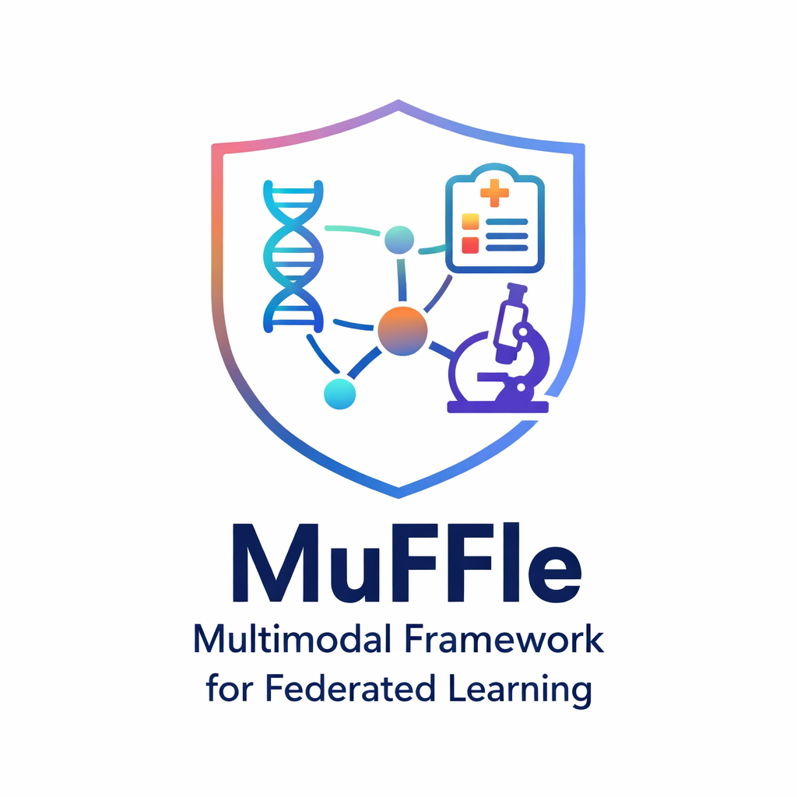
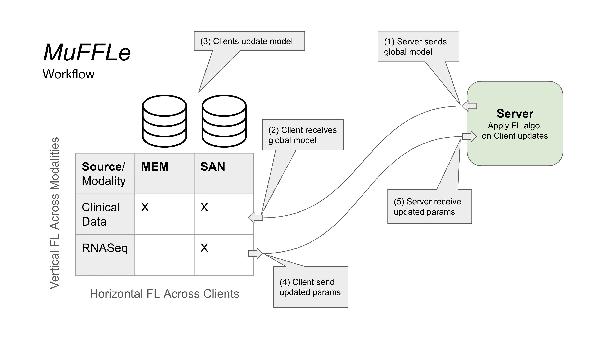
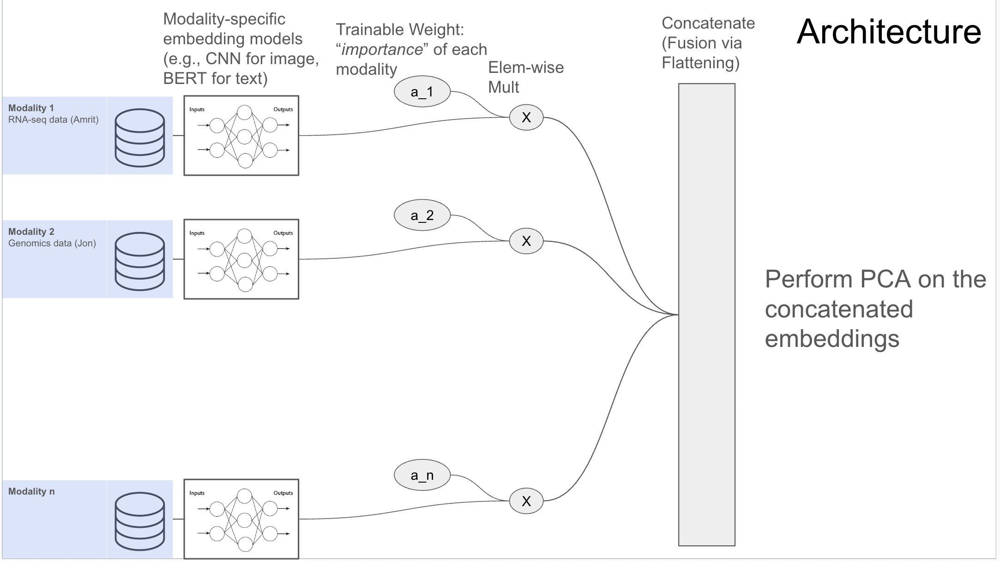

#  Multimodal Framework for Federated Learning (MuFFLe)

## TODO List + References:
- [X] Reference previous years' repos as inspo for this GitHub repo
  - [GeneVar2](https://github.com/collaborativebioinformatics/GeneVar2), a little *too* good because it was a 2nd followup project
  - [Haploblock Clusters](https://github.com/collaborativebioinformatics/Haploblock_Clusters_ElixirBH25)
- [X] Stick w the default MIT License, just don't use GPL or LGPL because industry can't use it 
- [X] (Tyler) Implement the baseline for Task 3 of Chimera in a federated setting (NVFlare)
- [ ] Use Chimera Task 3 leaderboard and other research to think about improvements or a potential way to use a federated model to do well on this task
  - [ ] Attention scores for the concatenated embeddings or more interpretable weights-per-modality (though this might have the issue where higher-dim embeddings affect the weights more/less bc they're bigger... not sure).
  - [ ] Maybe a combo of both where we do interpretable trainable weights per modality, then an attention layer within each modality.
- [ ] Now that we're in a federated setting, we can do updates for each modality independently, and thus we can extend each modality's data beyond the data merely provided in CHIMERA
  - [ ] e.g., find more histopathology data
  - [ ] e.g., find other potential modalities that might bolster our global fusion model (or we update our different fusion model architecture to take in this extra modality).
  - [ ] could explore PCA or some other method that just takes in generic embeddings, and thus our fusion model could take in as many different modalities as we want, and the embeddings just have their semantic meaning (this may be out of scope for the hackathon)



# Quick Start
```bash
# create a Python virtual environment (I used .venv, use conda or wtv you want)
source .venv/bin/activate # or however you activate your Python virtual environments.
pip install nvflare
# Install PyTorch optional dependencies
pip install "nvflare[PT]" # should also install torch and other necessary packages
pip install tensorboard matplotlib
pip install jupyter ipykernel
```
Run the jupyter notebook `prf-of-concept.ipynb`. This was built by extending the "Hello PyTorch" example from NVFlare (`hello-pt`) and modifying the clients such that each client only provided one modality of data (in the simple test, RNA for one client, Clinical Data for the other) and updates were done independently on both clients and aggregated on the server.

# Directory Structure
- [ ] Generate with Tree

# Introduction (1 para)
MuFFLe is a privacy-preserving framework for integrating multimodal biomedical data (RNA sequencing, clinical features) for cancer prognosis. Using NVIDIA's NVFlare, each hospital site trains on its local data and shares only model updates—not raw patient data—with a central server for aggregation.

Cancer prognosis models require multimodal data (imaging, RNA-seq, clinical variables) across institutions, but data sharing is restricted due to privacy, regulatory, and institutional barriers. Integrating transcriptomics with clinical features improves prognostic performance, but most hospitals cannot pool raw patient data across sites. Centralized training is often infeasible due to HIPAA constraints, motivating a federated learning approach where data remains local.

Using NVIDIA’s NVFlare, each hospital trains locally on its multimodal data and shares only encrypted model updates with a central server, enabling global model learning while preserving patient privacy.

# Methods (2 paras)
We use a late fusion architecture with modality-specific encoders: an RNA encoder projects gene expression data into 256-dim embeddings, while a clinical encoder maps patient features to 64-dim embeddings. These are concatenated and fed through a risk prediction head. Missing modalities are handled by substituting zero embeddings.

Training uses NVFlare's FedAvg algorithm across simulated sites, where each site specializes in one modality (e.g., Site-1 trains on clinical data, Site-2 on RNA). Sites receive the global model, train locally, and send weight updates back for aggregation—enabling collaborative learning while preserving privacy.

## Example Dataset and Task
We decided to go with the data for the [CHIMERA Challenge](https://registry.opendata.aws/chimera), which stands for
> Combining HIstology, Medical imaging (radiology) and molEcular data for medical pRognosis and diAgnosis
Details for the challenge are [here](https://chimera.grand-challenge.org/).

CHIMERA includes three tasks - Task 1: Prostate Cancer Biochemical Recurrence Prediction, Task 2: Bcg Response Subtype Prediction In High-Risk NMIBC, and Task 3: Bladder Cancer Recurrence Prediction. The CHIMERA Task 3 dataset contains histopathology and RNA sequencing along with clinical data per patient. 


*author's note, what a forced acronym :-)*

This data was open-access and easily available on [AWS Open Data](https://registry.opendata.aws/). 

We opted for [Task 3](https://chimera.grand-challenge.org/task-3-bladder-cancer-recurrence-prediction/) of this challenge. See [How we built this tool](#how-to-use-this-tool) for the reasons why we chose this task.

For the purpose of federated learning, we split the dataset into two “clients”: Cohort A and Cohort B. These cohorts come from slightly different RNA-seq protocols, simulating heterogeneity across institutions. No batch effect adjustment was performed between the cohorts in original raw dataset.

*@yiman add the rna plot here.*

In addition, several clinical conditions also varied between the two datasets, further highlighting the need of a multimodal federated learning algorithm.


This setup allows us to simulate a privacy-preserving, multi-institutional federated learning scenario, where each client trains locally on its data and only shares model updates with the central server, without exposing individual patient data.

## Setting up the baseline
The [CHIMERA repository](https://github.com/DIAGNijmegen/CHIMERA/tree/main) does not give great instructions for how to establish the task 3 baseline. *The README in that folder is 1 byte. As in it's blank. Very frustrating.* So we cloned the repository locally and recreated it ourselves. 

During development, we realized that the CHIMERA challenge ran for 4 months
>📢 Challenge Announcement & Registration Opens – April 10, 2025

>Training Data Release – April 10, 2025

>Validation Phase Begins – June 1, 2025 June 13, 2025

>Test Set Submission Deadline – August 1, 2025 August 22 AOE, 2025

(change the phrasing here say for the ease of time, we directly incorporated image based features already processed by the data authors instead of obtaining features from the images ourselves? -sounds bit professional haha) To decrease the scope of what we had to do and make it feasible for the hackathon, we threw out the image features and only developed on the RNA and clinical data inputs as a proof-of-concept.

## Extending the Challenge
(PROPOSED, NOT GUARANTEED YET) Because we have now implemented this in a federated setting, we can now extend each subtype of data provided in CHIMERA using other open-access datasets. (I'm just freestyling rn) For example, the histopathology data was extended with SOME DATASET HERE

# How we built this tool
We started by brainstorming potential ways to integrate multimodal data. We considered natively multimodal models, like Vision Transformers (ViT), but we opted not to do such a thing for several considerations:
1. Cost: fine-tuning large ViTs, even open-source ones such as [Qwen-3 VL](https://github.com/QwenLM/Qwen3-VL) is computationally expensive 
2. Catastrophic forgetting: similar to how RL updates may undo themselves over time, updates from different modalities might "cancel out" and lead to more confusion than actually meaningful results. 

As a result, we opted for an approach that better leverages smaller, more specialized models. This led us to the diagram below:


Which naturally lent itself to the very similar diagram from [CHIMERA, task 3](https://chimera.grand-challenge.org/task-3-bladder-cancer-recurrence-prediction/). **(Half serious) we want to emphasize that we dreamt up the diagram above before running into CHIMERA.**


For 177 data points for RNA and Clinical Data (*ignoring images to speed up development of the proof of concept*), we decided to distribute the training using NVFlare. Walking through the dummy example, we created two modality-specific encoders in the `SimpleNetwork` code below:
```python
# RNA projection network
self.rna_net = nn.Sequential(
    nn.Linear(rna_dim, 2048),
    nn.LayerNorm(2048),
    nn.ReLU(),
    nn.Dropout(0.3),
    nn.Linear(2048, 512),
    nn.LayerNorm(512),
    nn.ReLU(),
    nn.Dropout(0.3),
    nn.Linear(512, self.rna_out_dim) 
) # Output: 256

# Clinical projection network
self.clinical_net = nn.Sequential(
    nn.Linear(clinical_dim, 128),
    nn.ReLU(),
    nn.Dropout(0.2),
    nn.Linear(128, self.clinical_out_dim) 
) # Output: 64
```
These embeddings are then concatenated and passed through the fusion head to predict disease risk:
```python
# Final risk prediction head
self.risk_head = nn.Sequential(
    nn.Dropout(0.5),
    nn.Linear(self.rna_out_dim + self.clinical_out_dim, risk_output_dim)
) # Input size: 512 (Path) + 256 (RNA) + 64 (Clinical) = 832
```
We found that CHIMERA did not provide ground truth labels (*not really sure what that even means for disease risk prediction, this is WIP*) so we merely provided dummy labels using all zeros. We successfully ran NVFlare locally on an M3 MacBook Pro for 1 round, 2 epochs per round. 

# How to use this tool

# Future Directions
There are some low-hanging fruit that this could be applied to. While searching for instances to create our proof-of-concept, we came across some data from the Real-time Analysis and Discovery in Integrated And Networked Technologies (RADIANT) group, which 
> seeks to develop an extensible, federated framework for rapid exchange of multimodal clinical and research data on behalf of accelerated discovery and patient impact. 
[RADIANT Public Data (AWS)](https://registry.opendata.aws/radiant/).

We elected not to use this dataset because the S3 bucket had "controlled access," which required filling out a form for approval and did not fit the fast-paced nature of the Hackathon. However, our federated learning framework could be easily extended to RADIANT's data, which contains
> Clinical data, Imaging data, Histology data, Genomic data, Proteomics data, and more [Children's Brain Tumor Network (CBTN)](https://cbtn.org/research-resources).

# References (BibTeX)
